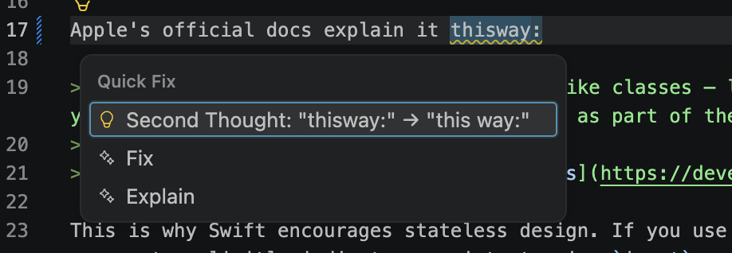
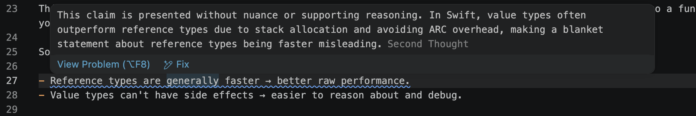

# Second Thought

An opinionated review harness for MDX writing.

<!-- 2-3 mondat: mit csinál (language + editorial pass), mit NEM bánt
     (frontmatter, kód, JSX), és hogy minden javaslat diffként jön. -->

<!-- Demó kép/GIF: VS Code quick fix. Amíg nincs, maradjon ki, ne placeholder. -->

## Status

Second Thought is a personal tool: I built it to review my own blog posts, thinking articles, deep bits and thinking bits.
It works on standard Markdown (`.md`) today. Support for my **own MDX** components **is planned**.

It runs two AI passes, both on Gemini's free tier:

- a **language pass** for spelling, grammar and punctuation, with suggested fixes
  (I may replace this with a rule-based, non-AI checker later)
- an **editorial pass** for structure and argument, with notes only

**The AI doesn't write for you.** It points out issues and suggests fixes,
and nothing in your file changes until you accept it.

## Quick start

**Requirements:** [Bun](https://bun.com) (developed on 1.4) and a Gemini API key.
You can get a free key in [Google AI Studio](https://aistudio.google.com/apikey).
The default model is `gemini-3.5-flash-lite`.

```bash
git clone https://github.com/asukix/second-thought.git
cd second-thought
bun install
echo "GEMINI_API_KEY=your-key-here" > .env   # .env is git-ignored
bun run review path/to/post.md
```

Run it from the repository root: Bun loads `.env` from the current directory.
The file you review can live anywhere.

Second Thought never writes to your file. It prints the findings and a unified diff
of the suggestions it could apply, and you decide what to keep.

**Example output** (abridged, from a real run on one of my posts):

```text
3 finding (post-008-mvvm-model-confusions.md):

- [language] punctuation: Remove the comma before the restrictive relative clause.
○ [editorial] missing concrete example: The text references code snippets and properties
  that are entirely missing from the text, leaving the L3 concrete example incomplete.
○ [editorial] prescriptive instead of trade-off: The conclusion takes a rigid, definitive
  stance on nomenclature rather than framing the trade-off of different naming conventions.

--- DIFF ---

@@ -253,5 +253,5 @@
 ## My question

-What is the `MenuItemModel`, that is used by `MenuViewModel`?
+What is the `MenuItemModel` that is used by `MenuViewModel`?
```

`✗` marks an error, `•` a warning, and `○` an editorial note. Editorial notes are advice
and never come with an edit. When a language fix can't be narrowed to the changed words,
the line ends with `(edit: llm)` or `(edit: sentence)`.

**Free tier limits:** each file takes two requests, one per pass. On a 429, the client
backs off and retries, so a large batch gets slower but doesn't fail.


## VS Code extension

The extension runs the same review inside VS Code: findings show up as underlines
and in the Problems panel, and language fixes can be applied with one click.

### Steps to use

1. Install and build the extension:

```bash
   cd vscode-extension
   bun install
   bun run build
```

2. Open the `vscode-extension` folder in VS Code and press `F5`.
   A new window opens with `[Extension Development Host]` in its title.
3. In that new window, open the article you want to review.
4. Open the Command Palette (`Cmd+Shift+P` / `Ctrl+Shift+P`) and run
   **Second Thought: Review Current File**.

The extension reads `GEMINI_API_KEY` from the same `.env` file as the CLI,
in the repository root.

### What you see

- **Language findings** underline spelling, grammar and punctuation mistakes.
  Put the cursor on one and press `Cmd+.` (`Ctrl+.`) to apply the suggested fix.

  

- **Editorial notes** point at structural issues: a missing code example, a buried
  main point, or a rule stated where a trade-off would fit better. They are advice
  only, so they never change your text.

  

## How it works

Second Thought is a harness around the LLM: only the passes communicate with it, everything else is plain code.
A review has the next steps:

1. **Parse.** The file is parsed into a syntax tree (unified + remark, with MDX and frontmatter support).
   If it can't be parsed, you get a single error finding instead of a crash.
2. **Segment.** The prose of the article is extracted together with its exact position in the file.
   Frontmatter, code blocks, inline code, JSX and imports are recorded as **protected ranges**.
3. **Review.** Each pass sends only the prose to the LLM.
   - The *language pass* gets back corrected sentences, and each fix is narrowed to the words that
     actually changed. For example, the underline covers `thisway`, not the whole sentence.
   - The *editorial pass* reads all the prose at once and returns notes, each anchored to a short quote.
4. **Guard.** Any suggestion that overlaps a protected range is dropped, whichever pass produced it.
5. **Diff.** The remaining suggestions are shown as a unified diff. Your file is not touched.

If the LLM fails in a way that would affect every request (quota, invalid key, outage), sthe remaining passes are skipped and you get one readable error instead of a list of failures.

<!-- Link a projektoldalra, ha elkészül: "Why it is built this way: [project page](...)" -->

## Project structure

| Layer | Where | What it does |
|---|---|---|
| Core | `src/*.ts`, `src/passes/` | the pass interface, the passes, parsing, guard, diff; no I/O |
| Port | `src/ports/` | the `LlmClient` interface the core depends on |
| Adapters | `src/adapters/` | Gemini (HTTP, retry, error translation) and a fake for tests |
| Frontends | `src/cli.ts`, `vscode-extension/`, `src/presentation/` | entry points and user-facing text |

Dependencies point inward: adapters and frontends import the core, never the other way around.
The core knows nothing about Gemini, the terminal or VS Code, so a future Swift app can reuse it.

## Testing

```bash
bun test
```

The default suite needs no API key and no network: the LLM is replaced by a fake,
and so is `fetch` in the adapter tests. The whole suite runs in well under a second.

### Test pyramid

**Unit tests:**

- the segmenter: prose extraction, protected ranges, a byte-for-byte round-trip
- edit narrowing and applying
- JSON extraction from LLM replies
- both passes against a fake LLM
- the Gemini adapter: retry and backoff, error mapping, and that the raw vendor response never leaks past the port
- the user-facing messages

**Integration tests:** `review()` with fake passes: diff building, the parse guard,
dropping edits inside protected ranges, and failing fast on systemic LLM errors.

**End-to-end tests:** the CLI spawned as a real process, covering its error paths.

A live smoke test against Gemini is skipped by default, because it uses your quota.
Run it with `SECOND_THOUGHT_LIVE=1 bun test`.

## Roadmap

A few of the next steps. The full list is in [BACKLOG.md](BACKLOG.md).

- **Code-aware editorial pass.** The editorial pass doesn't see code blocks yet, so it sometimes
  asks for an example that is already there. Next step: send short placeholders instead
  (for example `[code block: swift, 42 lines]`).
- **MDX components.** Support for my own components (such as `<Image>`) in the segmenter.
- **Personas per content type.** Blog posts, thinking articles and deep bits need different
  editorial standards.
- **Technical fact-check pass.** The editorial pass already catches some wrong technical claims,
  but only as a side effect. A dedicated pass would check them on purpose and back each note
  with evidence: a code snippet, an API symbol or a source link.

## License

MIT
